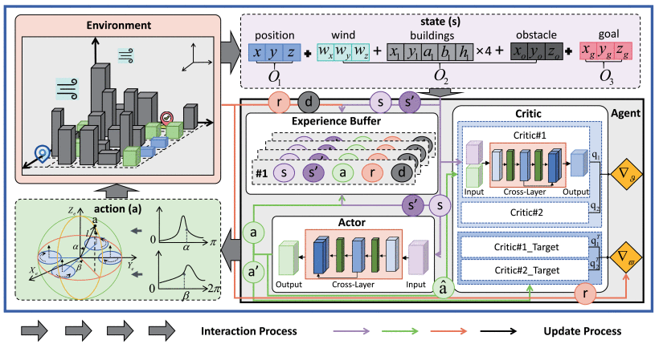

# UAVs Scheduling

## [Description](#description)
UAVs: Unmanned Aerial Vehicles

This repository is an up-to-date list of significant papers related to UAVs scheduling. It covers four steps of UAVs scheduling : mapping, task assignment, path planning, positioning & navigation.

## [Datasets](#)

### [FIReStereo](https://firestereo.github.io)

### [PDT Dataset](https://github.com/RuiXing123/PDT_CWC_YOLO-DP)

### [SUG-UAV Multirotor Dataset](https://github.com/Printeger/SUG-UAV-Multirotor-Dataset-IPIN2024)

### [Semantic Drone Dataset](https://github.com/japgarrido/pix2pix_image-generation)

## [Simulation Platform](#simulation-platform)

### [XTDrone](https://gitee.com/robin_shaun/XTDrone)

### [Prometheus](https://gitee.com/Fllying/Prometheus)

### [RlfySim](https://rflysim.com/doc/zh/)

## [Table of Content](#content)

<table>
<tr><td colspan="2"><a href="#review-articles">1. Review articles</a></td></tr>
<tr><td colspan="2"><a href="#mapping">2. Mapping</a></td></tr>
<tr>
    <td>&ensp;<a href="#problem-description">2.1 Problem description</a></td>
    <td>&ensp;<a href="#methods">2.2 Methods</a></td>
</tr> 
<tr>
    <td>&ensp;<a href="#references">2.3 References</a></td>
    <td>&ensp;</td>
</tr>
<tr><td colspan="2"><a href="#task-assignment">3. Task assignment</a></td></tr>
<tr><td colspan="2"><a href="#path-planning">4. Path planning</a></td></tr>
<tr><td colspan="2"><a href="#positioning-and-navigation">5. Positioning and navigation</a></td></tr>
<tr><td colspan="2"><a href="#applications">6. Applications</a></td></tr>
<tr>
    <td>&ensp;<a href="#smart-cities">6.1 Smart cities</a></td>
    <td>&ensp;<a href="#agriculture">6.2 Agriculture</a></td>
</tr> 
<tr>
    <td>&ensp;<a href="#delivery-or-transportation">6.3 Delivery or Transportation</a></td>
    <td>&ensp;<a href="#monitoring-or-emergency-response">6.4 Monitoring or Emergency response</a></td>
</tr>

</table>

## [Review articles](#content)

### [References](#content)

1. **The Drone Scheduling Problem: A Systematic State-of-the-Art Review**

   IEEE Transactions on Intelligent Transportation Systems, 2022. [survey](https://doi.org/10.1109/TITS.2022.3155072)

   *J. Pasha et al.*

1. **Swarm intelligence algorithms for multiple unmanned aerial vehicles collaboration: a comprehensive review**

   Artificial Intelligence Review, 2023. [survey](https://doi.org/10.1007/s10462-022-10281-7)

    *Jun Tang, Haibin Duan & Songyang Lao* 

1. **Towards the Unmanned Aerial Vehicles (UAVs): A Comprehensive Review**

   Drones, 2022. [survey](https://doi.org/10.3390/drones6060147)

   *Mohsan SAH, Khan MA, Noor F, Ullah I, Alsharif MH*
    
## [Mapping](#content)   

1. **SEER: Safe Efficient Exploration for Aerial Robots using Learning to Predict Information Gain**

   2023 IEEE International Conference on Robotics and Automation (ICRA). 
   [paper](https://doi.org/10.1007/s11370-022-00452-4) [framework](https://github.com/tyuezhan/SEER)

   *Y. Tao et al.*

1. **An Efficient Sampling-based Method for Online Informative Path Planning in Unknown Environments**

   IEEE Robotics and Automation Letters, 2020. [paper](https://arxiv.org/abs/1909.09548) [framework](https://github.com/ethz-asl/mav_active_3d_planning)

   *L. Schmid, M. Pantic, R. Khanna, L. Ott, R. Siegwart and J. Nieto*

1. **A Novel Online Path Planning Method for UAV-Based 3D Spectrum Mapping**

   2025 IEEE Wireless Communications and Networking Conference (WCNC). [paper](https://arxiv.org/abs/1909.09548)

   *Y. Chen et al.*

## [Task assignment](#content)

1. **Task assignment algorithms for unmanned aerial vehicle networks: A comprehensive survey**

   Vehicular Communications, 2022. [survey](https://doi.org/10.1016/j.vehcom.2022.100469)

   *Sabitri Poudel, Sangman Moh*

1. **Multi-UAV Task Assignment in Dynamic Environments: Current Trends and Future Directions**

   Drones, 2025. [survey](https://doi.org/10.3390/drones9010075)

   *Alqefari, Shahad, and Mohamed El Bachir Menai*

## [Path planning](#content)

1. **A real-time UAV delivery system considering dock selection and spatial conflict**

   Expert Systems with Applications, 2025. [paper](https://doi.org/10.1016/j.eswa.2025.127498)

   *Ziyi Hu, Yue Cao et al.*

   

   The article presents a real-time UAV delivery system that considers dock selection and spatial conflict avoidance to reduce delivery costs. 
   
   Key points:

    *	A **bi-level linear programming model** is used to determine the optimal number of docks and UAVs to minimize system and service costs.

    *	An Ant Colony Algorithm and **Q-learning** are used to select the optimal dock and avoid spatial conflicts, reducing UAV flight time and service costs.

    *	**Simulation** results show the proposed scheme outperforms other approaches in reducing UAV flight time, avoiding spatial conflicts, and is robust to different dock geographical distributions.

1. **A Lightweight Reinforcement-Learning-Based Real-Time Path-Planning Method for Unmanned Aerial Vehicles**

   IEEE INTERNET OF THINGS JOURNAL, 2024. [paper](https://doi.org/10.1109/JIOT.2024.3350525)

   *M. Xi et al.* 

   This study introduces a **lightweight reinforcement-learning-based** method called Adaptive **Soft Actor-Critic** (ASAC) for real-time path planning in Unmanned Aerial Vehicles (UAVs), particularly in complex urban settings.

   

   Key aspects of the study include:
       
    * An **adaptive temperature coefficient** dynamically adjusts the UAV's exploration probability based on the training phase and accumulated experience.
    * The reward function, crucial for agent performance, is designed as $R=r_{1}+r_{2}+r_{3}+r_{4}$, incorporating distance reward, collision penalty, time feedback, and final goal feedback.
    * The UAV's state space includes its location, environmental information (wind, buildings, obstacles), and the goal position. Its action space consists of attitude angles.
    * The algorithm operates in two phases (interaction and update) and comprises four components: Environment, Actor, Critics, and Experience Buffer.

## [Positioning and navigation](#content)

## [Applications](#content)

### [Smart cities](#content)

1. **Unmanned aerial vehicles based low-altitude economy with lifecycle techno-economic-environmental analysis for sustainable and smart cities**

   Journal of Cleaner Production, 2025. [survey](https://doi.org/10.1016/j.jclepro.2025.145050)

   *Yuekuan Zhou*

### [Agriculture](#content)

1. **Recent Advances in Crop Disease Detection Using UAV and Deep Learning Techniques**

   Remote Sensing, 2023. [survey](https://doi.org/10.3390/rs15092450)

   *Shahi, Tej Bahadur, Cheng-Yuan Xu, Arjun Neupane, and William Guo*

### [Delivery or Transportation](#content)

1. **Unmanned Aerial Vehicles in Last-Mile Parcel Delivery: A State-of-the-Art Review**

   Drones, 2025. [survey](https://doi.org/10.3390/drones9060413)

   *Mohamed A, Mohamed M*

### [Monitoring or Emergency response](#content)

1. **A comprehensive survey of research towards AI-enabled unmanned aerial systems in pre-, active-, and post-wildfire management**

   Information Fusion, 2024. [survey](https://doi.org/10.1016/j.inffus.2024.102369)

   *Sayed Pedram Haeri Boroujeni, Abolfazl Razi, et al.*

2. **Addressing disasters in smart cities through UAVs path planning and 5G communications: A systematic review**
   
   Computer Communications, 2021. [survey](https://doi.org/10.1016/j.comcom.2021.01.003)

   *Zakria Qadir, Fahim Ullah, Hafiz Suliman Munawar, Fadi Al-Turjman*

